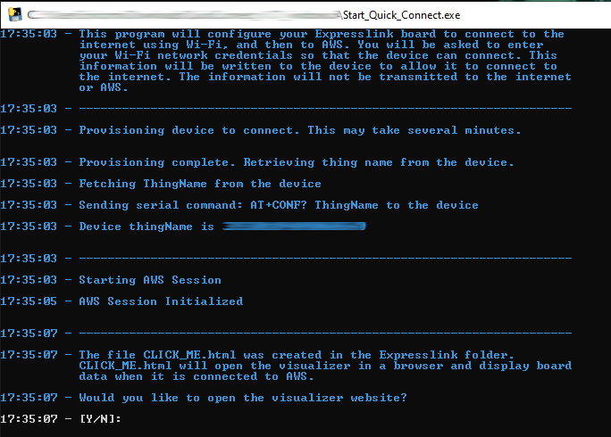
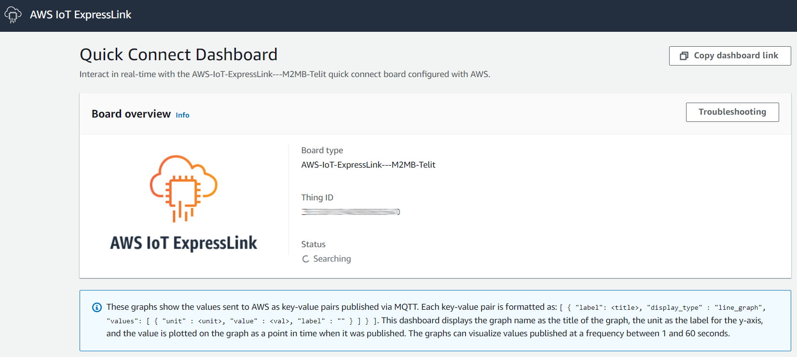
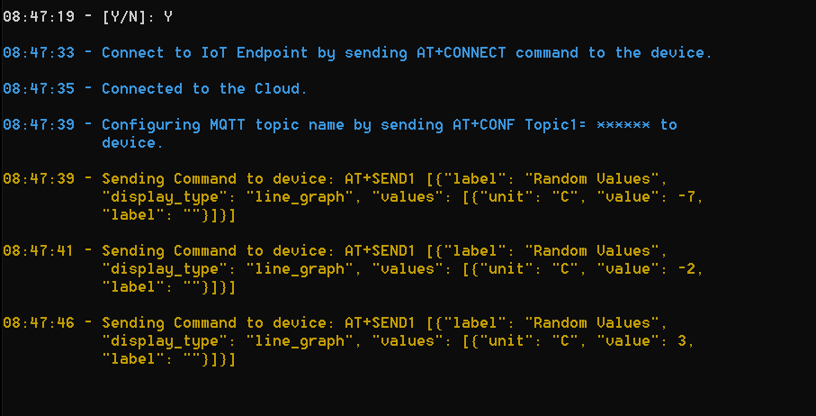
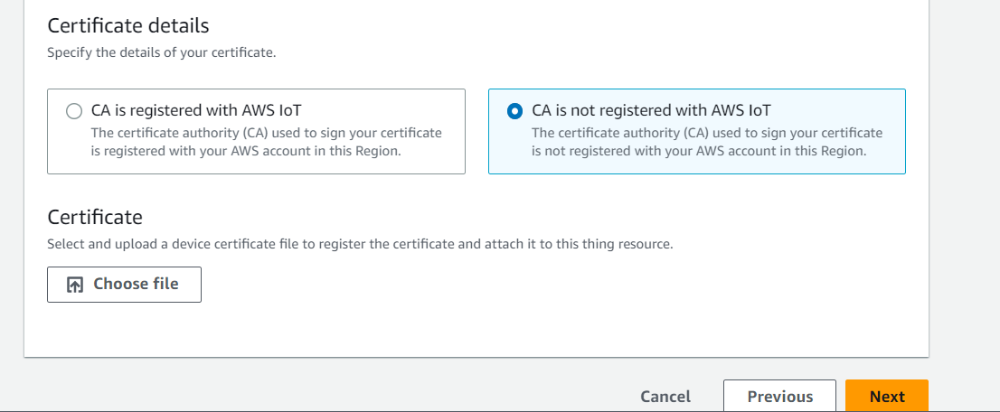
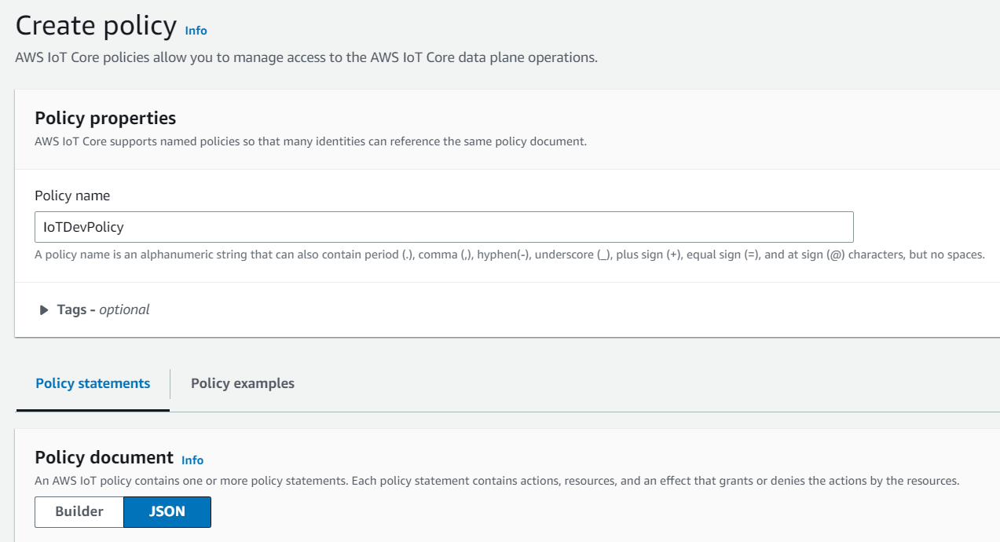
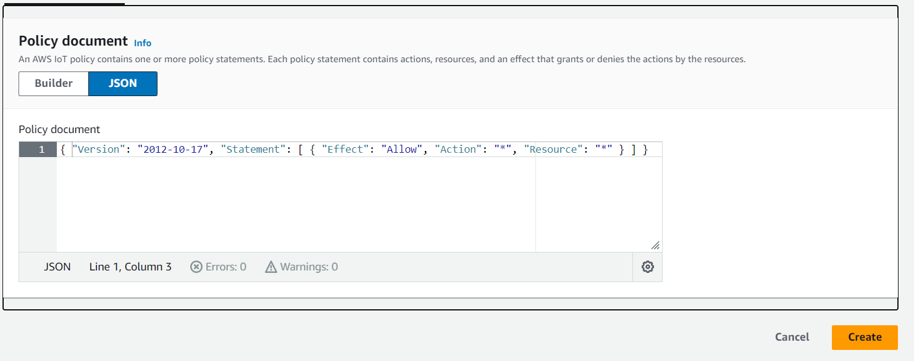
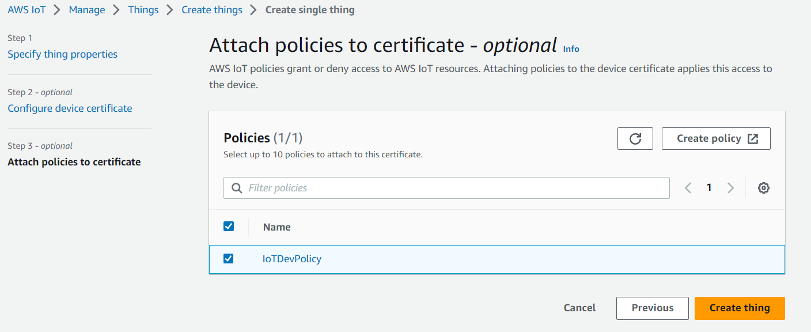
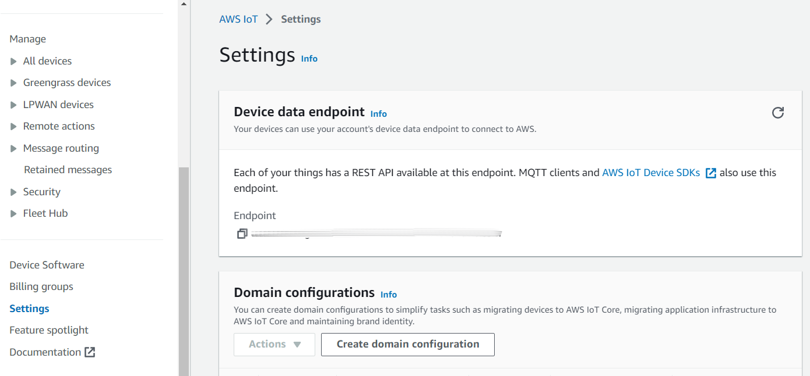

# Getting started guide for Telit Cinterion Bravo rapid development kit with AWS IoT ExpressLink

# Document information

## Naming conventions

## Glossary
| Term       | Description                                       |
|------------|---------------------------------------------------|
| APN        | Access Point Name - used to define the LTE access |
| 

## Revision history

| Version | Date       | Notes       |
|---------|------------|-------------|
| 1.0     | 2023-03-06 | First issue |

# Overview

# Hardware Description

Bravo development kit with AWS IoT Expresslink LE910C1-WWXD comes with a variety of hardware components and features. 
1. LE910C1-WWXD AWS LTE Cat.1 modem with pre-injected credentials and ExpressLink qualified firmware
1. Embedded LTE Antenna
1. Embedded Bosch Sensors
1. MikroBus socket
1. Socket for Arduino, Raspberry Pi, Raspberry Pi Zero
1. USB for direct modem communication
1. USB with FTDI interface 
1. Power supply: 5-25 VDC, battery socket, Raspberry HAT
1. GPIOs pinout
1. control LEDs (GPIO customizable)
1. push buttons (GPIO customizable)
1. UART pinout
1. I2C
1. SPI
1. on-off and reset buttons
1. SIM slot

The following image schematizes the main components. 

## Datasheet

You can find the Bravo AWS product brief, the FAQ and the Quick start guide here: https://www.telit.com/bravo-evk-download-zone/

Some of the guides and manuals require login access. Please register here https://dz.telit.com/register

When you fill up the form, if you do not have a Telit Cinterion Point of Contact, please specify **Bravo AWS IoT ExpressLink**

## Standard kit Contents

Bravo AWS IoT ExpressLink comes with a set of accessories to simplify the developer experience without the need of third party components.

Content of the package:

1. Bravo AWS IoT ExpressLink Board, which includes LE910C1-WWXD AWS LTE Cat.1 Module
1. External GNSS Antenna
1. microUSB cable
1. SIM card
1. BERG connector kit

## User Provided items

You need to connect the Bravo with AWS IoT ExpressLink to a host processor.
As a mere example you can use:
* Raspberry Pi / Pi Zero
* Arduino
* PC (Windows/Linux/Mac)
* Power adapter, barrel center positive 2.1 mm / 5mm with 10W min e.g. https://www.amazon.com/SoulBay-Universal-Multi-Voltage-Selectable-Electronics/dp/B01N2K48HR/

## 3rd Party purchasable items

Additional MikroBus sensors and peripherals to complement the existing range of embedded sensors

# Set up your hardware

In this get started example we suggest to use a PC for a quick check of the capabilities of Bravo AWS IoT ExpressLink. 

However, any other external processor can be connected to the Bravo board: Follow the Bravo get started guide to configure appropriately.
Please refer to please see https://www.telit.com/bravo-evk-download-zone/ doc: Telit_Bravo_Quick_Start_Guide for full details on how to connect to the Bravo Board

1. plug the SIM card provided, which has (almost) global coverage. If you are willing to use a different SIM card please make sure your region/country supports LTE Cat.1 connectivity and SIM PIN is disabled
2. connect the Bravo board to your PC
3. connect the power supply  
4. press and hold for 5 seconds the on/off button 
5. on Windows, take note of the com ports and make sure you connect to the first com port available. Please see https://www.telit.com/bravo-evk-download-zone/ doc: Telit_Bravo_Quick_Start_Guide section 3

# Set up host machine

To establish a serial connection between your host machine and the *Bravo AWS IoT ExpressLink*, you must install the USB to UART Bridge Virtual Communication Port drivers. You can download these drivers from [Telit IoT developer Resources - USB Drivers](https://www.telit.com/evkevb-drivers/). For more information, see the driver user guide included in the zip archive. 
Open a terminal application for your host machine (e.g., TeraTerm for Windows, CoolTerm for Mac) and select the port corresponding to the evaluation kit. Configure the terminal application as follows:
| Parameter        | value         |
| -----------------|---------------|
| Baudrate:        | 115,200       |
| Bits:            | 8             |
| Parity:          | None          |
| Stop:            | 1             |
| Flow control:	   | None          |
| Local Echo:      | Yes           |

For a quick check, in the terminal window type: `AT` followed by `<return>`. If you receive the answer `OK`, Congratulations! You have successfully connected the evaluation kit to your host machine.

Keep the terminal open, as it is needed for subsequent steps.

# Raspberry setup
Make note of the GPIOs exposed on the Raspberry Pi pinout

| Bravo Pinout | Signal | I/O |
|--|--| --|
| 15 | TX | Output |
| 14 | RX | Input |
| 23 | RESET | Output |
| 27 | EVENT | Input |
| 22 | WAKE | Output |

Make sure your script is using the right GPIOs to interact with Bravo ExpressLink

# Run the quick connect demo application

The Quick Connect demo application allows you to establish a connection with AWS IoT, all in the space of a few minutes; no dependencies to install, no source code to download and build, and no AWS account required. To run the demo, follow the below steps:

1.	If you opened a terminal application in the previous step, be sure to disconnect that application from the serial port. 
1.	Download the Quick Connect executable:
    1.	[Download for Mac](https://quickconnectexpresslinkutility.s3.us-west-2.amazonaws.com/QuickConnect_v1.9_macos.x64.tar.gz)
    1.	[Download for Windows](https://quickconnectexpresslinkutility.s3.us-west-2.amazonaws.com/QuickConnect_v1.9_windows.x64.zip)
    1.	[Download for Linux](https://quickconnectexpresslinkutility.s3.us-west-2.amazonaws.com/QuickConnect_v1.9_linux.x64.tar.gz)
1.	Unzip the package. You will see a config.txt file. Open this and enter the serial port corresponding to the evaluation kit (for example, COM14, /dev/cu.usbserial-12345, and so on) in the serial port field.
1.	For wifi kits, enter your wifi credentials in the SSID and Passphrase fields. For cellular kits, you may leave this blank.
1.	Run the "Start_Quick_Connect" executable.

The demo will connect to AWS IoT and give you a URL that you can use to visualize data flowing from the device to the cloud using AT+SEND commands. The demo will run for up to two minutes, and afterwards, you will be able to type `AT+SEND` commands yourself and see the data coming in on the visualizer. 

Start QuickConnect

Enter "Y" to save an html file inside the working directory of QuickConnect

Click on the link, a browser window will open. This page, called **Quick Connect Dashboard**, will be populated with data sent from your Bravo AWS IoT ExpressLink

QuickConnect is now sending data to the Dashboard

 

You can see in the **Quick Connect Dashboard** that data is actually sent to IoT Core and visually presented in the dashboard.

The following sections will guide you through next steps when you will set up your AWS account and interact with the modules to send and receive data directly with your AWS account.

# Setup your AWS account and permissions for IoT development

Refer to the instructions at [Set up your AWS Account](https://docs.aws.amazon.com/iot/latest/developerguide/setting-up.html).  Follow the steps outlined in these sections to create your account and a user and get started:

1.	Sign up for an AWS account and 
2.	Create a user and grant permissions. 
3.	Open the AWS IoT console

Pay special attention to the Notes.

# Registering an AWS IoT ExpressLink to your development account

To create an IoT *Thing* and add it to your account we will need to retrieve the AWS IoT ExpressLink module Thing Name and its corresponding certificate. Follow the below steps:

1.	Open the [AWS IoT Console](http://console.aws.amazon.com/iot).  Select **Manage** then select **Things**.  Choose **Create things**, select **Create single thing**, click **Next**.

2.	In the terminal application type the command:  `AT+CONF? ThingName`
3.	Copy the returned string (a sequence of alphanumeric characters) from terminal. On the **Specify thing properties** page, paste the copied string from terminal into the **Thing name** under Thing properties on the console. Leave other fields as default, then click **Next**.

4.	In the terminal application type the command: `AT+CONF? Certificate pem`
5.	Copy the returned string (a longer sequence of alphanumeric symbols), save into a text file on your host machine as **“ThingName.cert.pem”**. 

6.	On the Configure device certificate page, select **Use my certificate**, choose **CA is not registered with AWS IoT**.

7.	Under **Certificate**, select Choose file. Double click on “**ThingName.cert.pem**” file in step 5.

8.	Under **Certificate Status**, select **Active**
9.	Click **Next** to **Attach policies to certificate**.
10.	Under **Secure**, select **Policies**. 
11.	Click **Create** to Create a policy. Put policy name (e.g. IoTDevPolicy) and click **Advanced mode**. 

12.	Copy the below section into the console.

`{ "Version": "2012-10-17", "Statement": [ { "Effect": "Allow", "Action": "*", "Resource": "*" } ] }`

> *NOTE – The examples in this document are intended only for dev environments.  All devices in your fleet must have credentials with privileges that authorize only intended actions on specific resources. The specific permission policies can vary for your use case. Identify the permission policies that best meet your business and security requirements.  For more information, refer to [Example policies](https://docs.aws.amazon.com/iot/latest/developerguide/example-iot-policies.html) and [Security Best practices](https://docs.aws.amazon.com/iot/latest/developerguide/security-best-practices.html)*

Click Save to complete the Thing creation
13. Return to the **Create Single Thing** page and attach the policy

14.	In the AWS IoT Console, choose **Settings**, copy your account *Endpoint* string in *Device data endpoint*.

15.	In the terminal application type the command: `AT+CONF Endpoint=<your endpoint string here>`.

## Completion

Congratulations! You have completed the registration of the evaluation kit as a Thing in your IoT account. You will not need to repeat these steps the next time you connect, as the AWS IoT ExpressLink module will remember its configuration and will be ready to connect to your AWS account automatically

#	Connecting and Interacting with AWS cloud

We will use the MQTT client in the AWS IoT console to help us monitor the communication between your evaluation kit and the AWS Cloud. 

1.	Navigate to the AWS IoT console (https://console.aws.amazon.com/iot/).
2.	To open the MQTT client, in the navigation pane, choose **Test** and then **MQTT Test Client**.
3.	In _Subscribe to a topic_, enter `#`, and then click **Subscribe**

## Connecting

Before establishing a connection, you need to set up the **APN** to create the connection.
Issue the command `at+conf APN=nxt20.net`

Establish a secure connection by entering the command: `AT+CONNECT`
After a short time, you will receive the message `OK 1 CONNECTED`

Congratulations! You have successfully connected to your AWS cloud account

## Sending data to the AWS cloud

To send “Hello World!” message, first enter the command `AT+CONF Topic1=data`

You will receive the response from the module: `OK`

Next, enter the command: `AT+SEND1 Hello World!`

After a short time, you will receive the message `OK`

You should see the “Hello World!” message appear on the AWS IoT console under the topic “data” of the **MQTT Test Client**.

## Receiving data and commands from the cloud

To receive messages, first enter the command: `AT+CONF Topic1=MyTopic`

You will receive the response from the module: `OK`

Next, enter the command: `AT+SUBSCRIBE1`

From the AWS IoT console, **MQTT client**, select **Publish to a topic**, type **MyTopic** in **Topic name** field, keep **“Hello from the AWS IoT console”** message then click **Publish**.

On your terminal, enter the command: `AT+GET1`

You will receive the message `OK Hello from AWS IoT console`

# Perform Firmware Over-The-Air Update for AWS IoT ExpressLink

## Prerequisites

Download the latest signed image firmware from [Telit Cinterion Download Zone](https://telit.com/download-zone). Along with the firmware image, you will download additional signing metadata such as:

1.	Signature hashing algorithm used (Example: SHA-256)
2.	Signature encryption algorithm used (Example: ECDSA)
3.	Actual signature encoded using the base64 encoding format.
4.	The path name (a string) which identifies the location where the certificate is provisioned in the ExpressLink (optional)
5.	Create an OTA Update role in your account using the steps outlined [here](https://docs.aws.amazon.com/freertos/latest/userguide/create-service-role.html).

For further information please check [Telit Cinterion Download Zone](https://telit.com/download-zone) or contact [TS-EMEA](mailto:ts-emea@telit.com).

## Creating a Firmware Update job in AWS IoT

 Please refer to the AWS IoT ExpressLink [Getting Started Guide - Create a firmware update job in AWS IoT](https://docs.aws.amazon.com/iot-expresslink/latest/gettingstartedguide/elgsg-setup-ota-update.html#elgsg-setup-ota-update-create)

## Monitoring and Applying new firmware update for ExpressLink

Please refer to the AWS IoT ExpressLin [Getting Started Guide - Monitor and Apply a new firmware update for ExpressLink](https://docs.aws.amazon.com/iot-expresslink/latest/gettingstartedguide/elgsg-setup-ota-update.html#elgsg-setup-ota-update-monitor)

# Troubleshooting

> Please make sure you have checked the [AWS IoT ExpressLink Documentation](https://docs.aws.amazon.com/iot-expresslink/) and [AWS IoT ExpressLink Examples and Training Material](https://github.com/aws/iot-expresslink)

## Cannot connect

1. Make sure you inserted the SIM
2. Check SIM and make sure PIN is not required: `at+diag TELIT AT+CPIN?` should return `+CPIN: READY<CR>OK`

## QuickConnect is not working

1. Make sure you've downloaded the right software, depending on your Operating System
2. If the program terminates right after "AWS Session Initialized" make sure that your PC can establish a connection to AWS: after configuring your AWS CLI try `aws iot list-things`. If it doesn't work please check with your IT admin.

If you cannot find an answer to your issue, please contact [TS-EMEA](mailto:ts-emea@telit.com)

