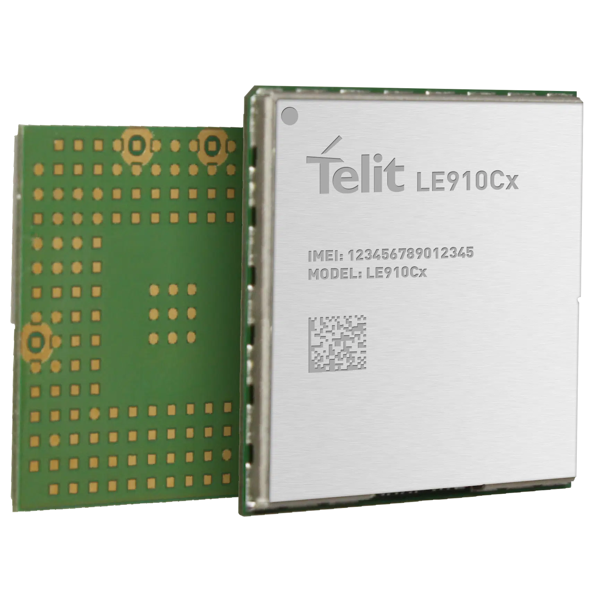

# Getting started guide for Telit Cinterion LE910C1-WWXD_AWS with AWS IoT ExpressLink 

# Document information

## Naming conventions

## Glossary
| Term       | Description                                       |
|------------|---------------------------------------------------|
| APN        | Access Point Name - used to define the LTE access |
| GPIO | General Purpose Input/Output |
| LGA | Large Grid Array |
| LTE | Long Term Evolution, cellular technology that bridges the 4G generation to the 5G | 
| SMD | Surface Mount Device | 
| VDC | Volts, Direct Current |

## Revision history

| Version | Date       | Notes       |
|---------|------------|-------------|
| 1.0     | 2023-04-19 | First issue |

# Overview

# Hardware Description

Telit Cinterion LE910C1-WWXD_AWS is the first Cat.1 module that qualifies for AWS IoT ExpressLink. 
Consisting of an industrial-grade module with LGA form factor for surface mount, it provides a wide range of peripherals to fit the needs of a variety of cellular IoT applications that work with AWS IoT
1. LE910C1-WWXD_AWS LTE Cat.1 modem with pre-injected credentials and ExpressLink qualified firmware
1. LTE Antenna pinout
1. GPIOs pinout
1. dual SIM pinout
1. USB OTG pinout
1. 1.8 VDC power supply 
1. power control signals

The following image represents the front and the read of the LE910C1-WWXD_AWS. 

## Datasheet

You can find the LE910C1-WWXD_AWS product brief, the FAQ and the Quick start guide here: https://www.telit.com/bravo-evk-download-zone/

Some of the guides and manuals require login access. Please register here https://dz.telit.com/register

When you fill up the form, if you do not have a Telit Cinterion Point of Contact, please specify **LE910C1 AWS IoT ExpressLink**

## AWS IoT ExpressLink signal Pinout 
Make note of the GPIOs exposed on the LE910C1-WWXD. Please note that GPIOs work in the range 0 - 1.8 VDC: if you need a level shifter you can drive the reference 1V8 with GPIO1. 

| PAD Symbolic signal |  Signal | I/O |
|--|--|--|
| GPIO 1  | Level shifter driver (optional) | Output |
| GPIO 2 | WAKE | Output |
| GPIO 3 | RESET | Output |
| GPIO 4 | EVENT | Input |
| MAIN UART RX C104/RXD | RX | Input |
| MAIN UART TX C103/TXD | TX | Output |

For further information please refer to the  [Hardware Design Guide](https://dz.telit.com/file/download/2312) section _Module Connections >>  Pin-out_

## Standard kit Contents

LE910C1-WWXD_AWS comes in tape or reel boxes and it is intended  for manufacturing or HW development. 
To get started with the product we recommend to purchase the appropriate development and evalution kit: 
1. here [Bravo Development Kit with AWS IoT ExpressLink](https://www.telit.com/support-tools/development-evaluation-kits/bravo-aws-expresslink/) 
2. or here [AWS device catalog page for Bravo Development Kit with AWS IoT ExpressLInk](https://devices.amazonaws.com/detail/a3G8W0000008011UAA/Bravo-LE910C1-WWXD-with-AWS-IoT-ExpressLink). It comes with a set of accessories to simplify the developer experience  and gets you started with AWS IoT ExpressLink in few minutes.

While the Bravo board is shipping, please start reading the [Bravo Development Kit with AWS IoT ExpressLink - Get started guide](get-started-guide-bravo-aws.md) 

